# Active-Directory-for-IT-support
An extensive overview on common Helpdesk and IT support processes involving Active Directory.

### Section 1: Installation
- Downloading AD/DC
- Installing
- Creating Organisational Units
- setting up password Policy, Account lockout policy, screen lock policy
- Onboarding and user creation
- Adding Users to Groups

### Section 2: Troubleshooting
 - User lockouts
 - Account disabled
 - Account Expired
 - Folder Permission

### Active Directory Definition : 
A service/database that records information on users, applications, groups, and other network devices. It's used for centralized monitoring through a domain controller.

# Installation 
- Download the ISO file of Windows Server 2022. (You will have to create an account. The server is free for 180 days).
Mount the image on the VM and install WinServer.

### In Server Manager:
Click "Manage" (top left)
Select "Role-based or Feature-based Installation"
Select "your server"
Install "Active Directory Domain Services"
Complete the installation wizard

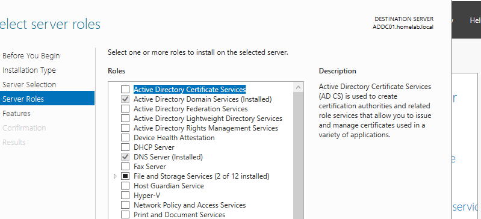 

### Promote the server to a Domain Controller:

Click the notification flag
Select "Promote this server to a domain controller."
Create a new forest with a domain name of your choice
Set a password and complete installation (server will restart)

## Creating an Organizational Unit 
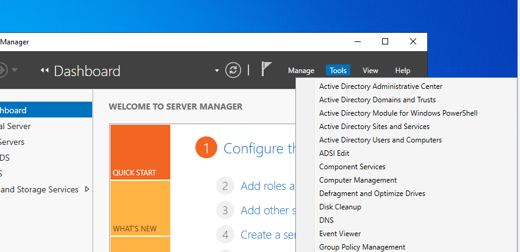
I will create 4 organisational units: CEO, IT, HR, and Employees
- Open Server Manager → Tools → "Active Directory Users and Computers"
- Right-click on the domain name ( mine is: homelab.local) > New Organizational Unit 

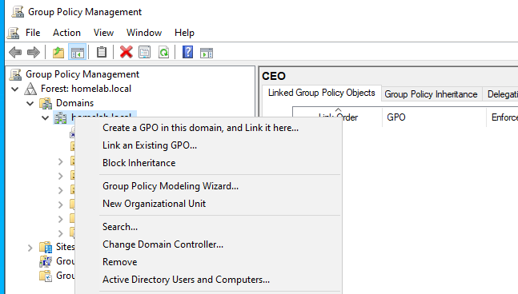
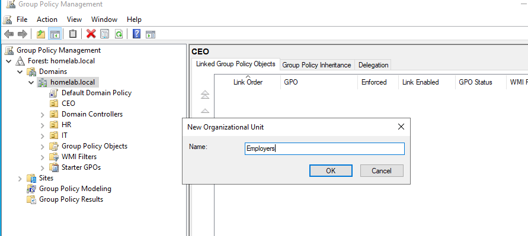
Repeat the process for the others

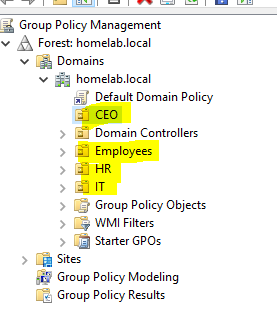

## Setting password policy
- AD server manager > Tools > Group Policy Manage
- Right click " Default domain Policy" > Edit
A new window appears showing computer configurations
- Computer configuration > Windows Settings > Security Settings > Account Policies
- Double-click on password policies and do you modifications

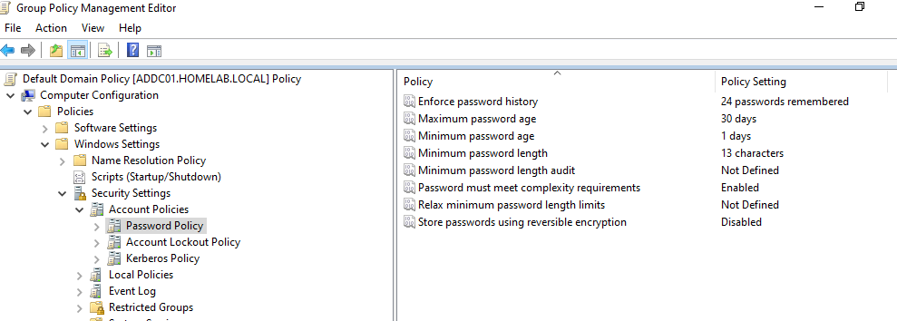

  ## Account Lockout policy
Still on computer configurations:
- Computer configuration > Windows Settings > Security Settings > Account Lockout Policies

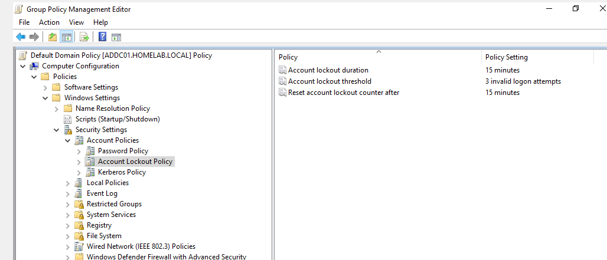

## Screenlock policy
 Still on computer configurations:
- Computer configuration > Windows Settings > Security Settings > Local policies > Security options.

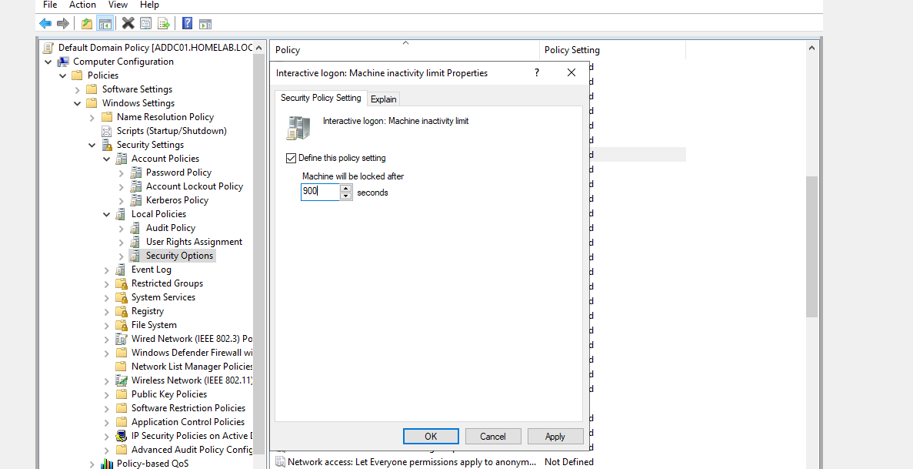

  
At the end, you can have an overview of all the passwords you've set
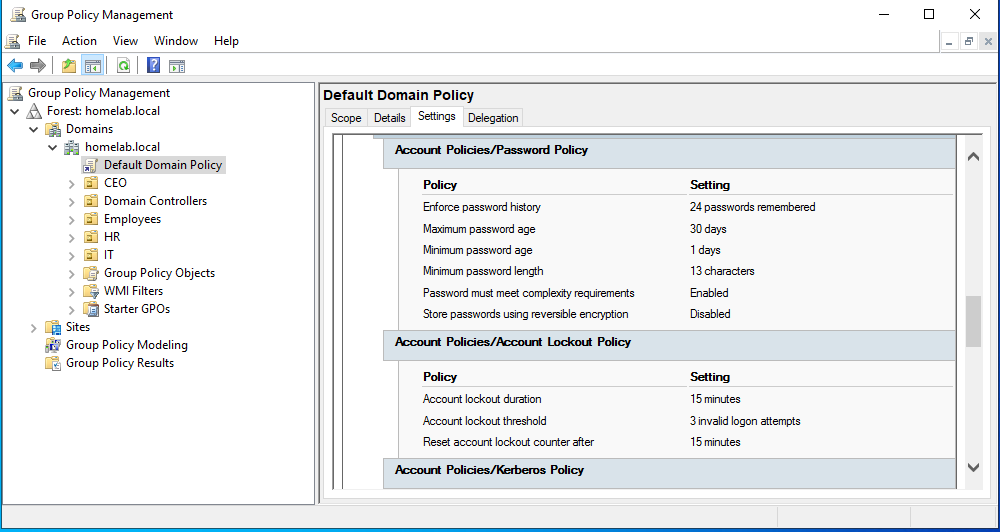

 #### Important! 
 Enforce all your modifications by updating. There are two ways to achieve this.
- Group policy manager > right click on "Domain controller" > Group policy update
  
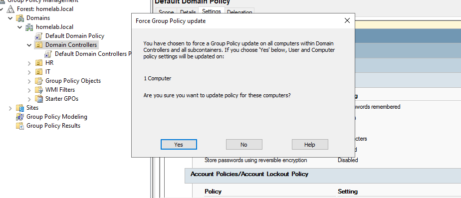

  ##### Or
- A way to bypass it is by updating directly on the PowerShell command line using:
 gpupdate /force.

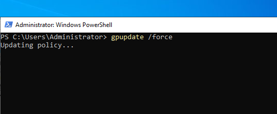

# Section 2: Troubleshooting

### 1)  Onboarding and User creation 
I am going to create 4 users for each organisational unit + one Service Account

* HR > Orlando Bloom
* IT > Jenny Peterson
* CEO > James Kay
* Employee > Lisa Klyde

### Creating Lisa Klyde

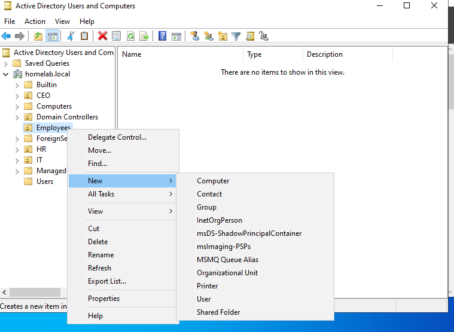
- Server Manager > Tools > Users and Computers

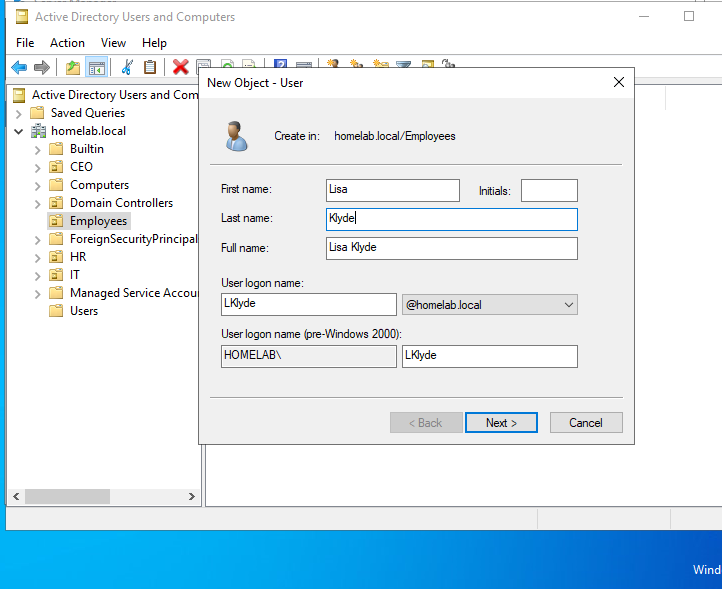
-	Right-click on the created Usergroup > new. Proceed with the name and passwords
-	NB: The user logon name is what the user will use to connect to their computer
-	Create a temporary password that matches your policy.
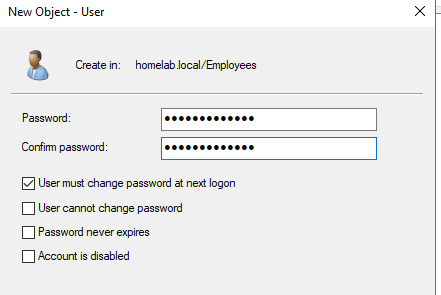

### 2) Service account creation
This account is for guests, technicians, or temporary people who will need to join the company for a given amount of time
   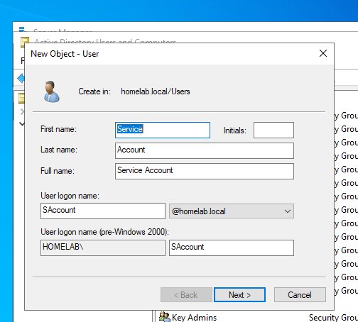
- Server Manager > Tools > Users and Computers
- Right-click on the created Usergroup > new. Proceed with the name and passwords
-	I chose password never expires, user can’t change password, and account disabled for a more practical overview
  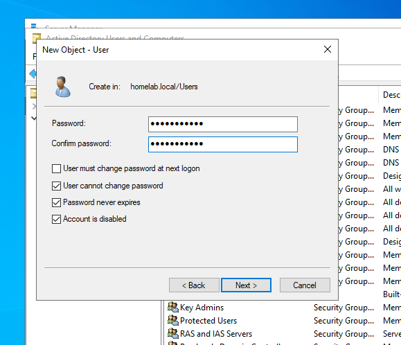
-	As you can see, the Service account has an arrow down, which means the account is inactive and has to be activated

### 3) Adding Users to Groups
It is very important to organize users into groups. The most common groups include 
Administrative ( Full privileges), IT- Support, Sales, Print operators, and remote desktop users.
I will add the CEO to the Administrators Group.

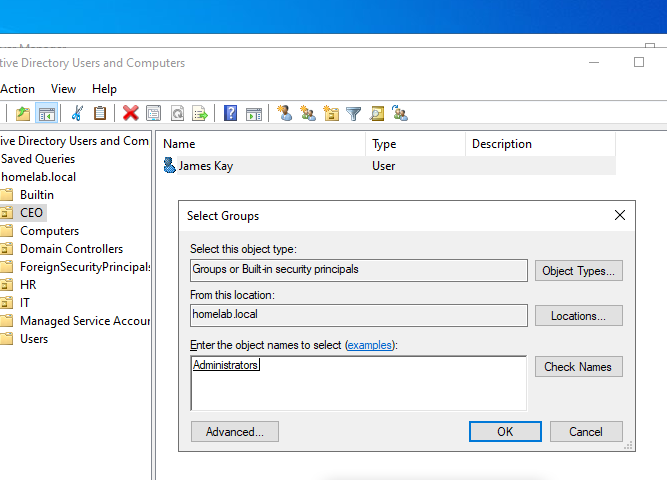

# Section 2: Troubleshooting

When troubleshooting, there is a basic way of handling things, which is ;
•  Identify the problem. 
•  Establish a theory. 
•  Test the theory. 
•  Create a plan and implement it. 
•  Verify full functionality. 
•  Document findings and actions.
There are a few basic rules inherent in the corporate environment that I will set to make this project more realistic. Help Desk usually doesn't create the policies, but it is important to know the common Active Directory and Group Policy settings that organizations enable

1)	Account Lockout
This example will include the Account I created, Orlando Bloom from the HR department. After a vacation, he tried to access his account three times and was blocked each time. He calls the IT support asking for help to reinitialize his account.

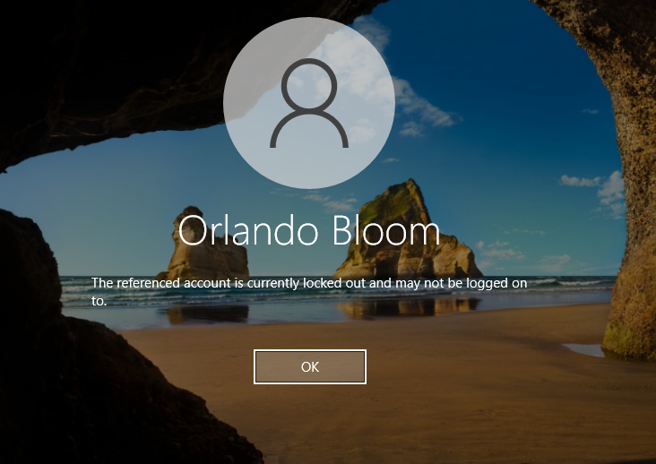

Solution
-	Server Manager > Tools > Users and Computers
-	Right-click on your AD domain > Find
-	Type the name of the locked-out account
-	Double click on a User > Account

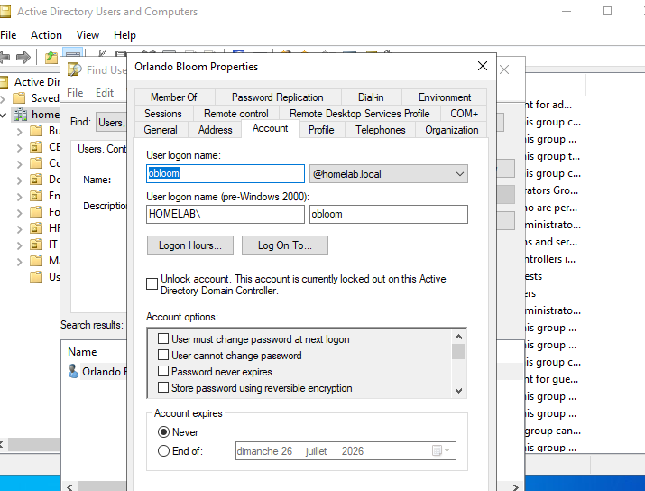

Path 1: If the User finally remembers the password.
-	You will have the opportunity to simply click on unlock
Path 2: If he doesn’t remember the password
-	You unlock the account
-	Right-click on User >  Reset password (change the password and give it to the user), and check that the user must change their password.

2)	Account disabled
A recently hired contractor tries to log into the company’s service account and receives this message informing him the account has been  disabled. He called IT.

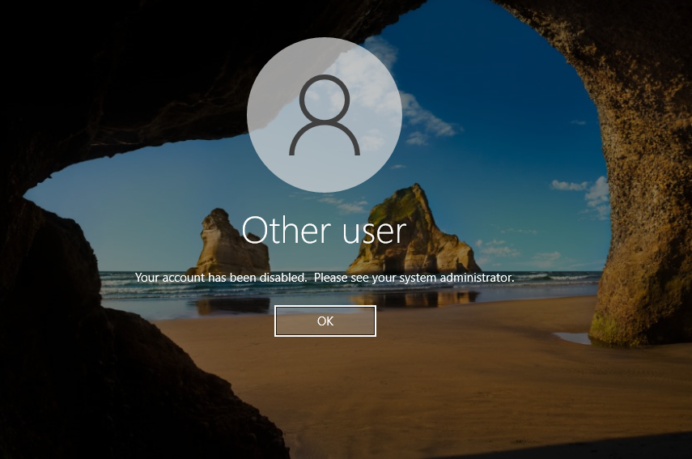

Solution 
-	Server Manager > Tools > Users and Computers
-	Right-click on your AD domain > Find > Write down the name
The arrow on the user confirms that the account has been disabled. To remediate this; 
-	Right-click on User > Enable account
-	Refresh your page, and that will fix it

  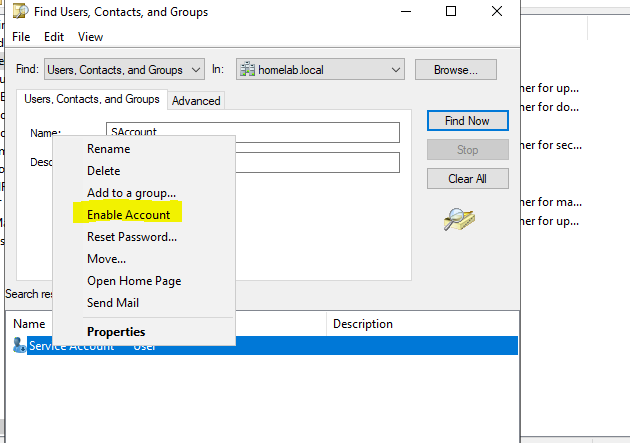

3)	Account Expired
Jenny Paterson, an intern, tries to log into her account and receives this message stating her account has expired. She calls IT
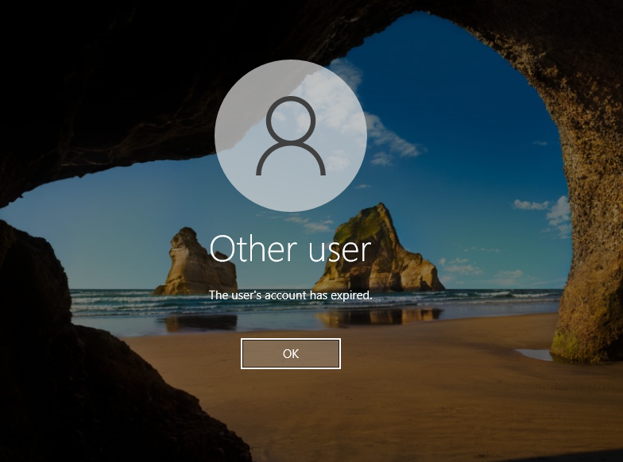
Solution
-	Server Manager > Tools > Users and Computers
-	Right-click on your AD domain > Find > Write down the name
-	Double click on a User > Account
You can see the account expired a month ago. First, consult with HR and modify accordingly. All you have to do is put a new expiration date, and she will access her account
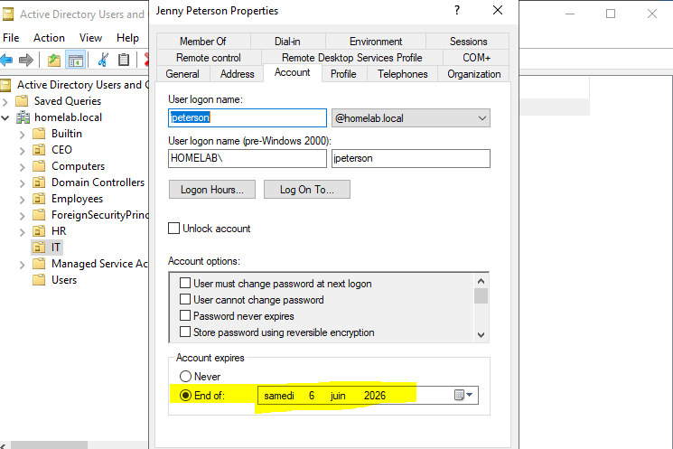

4)	Folder Permission
Obloom, from HR, can’t access an important file. It says he doesn’t have access and to contact the administrator, so he calls you 

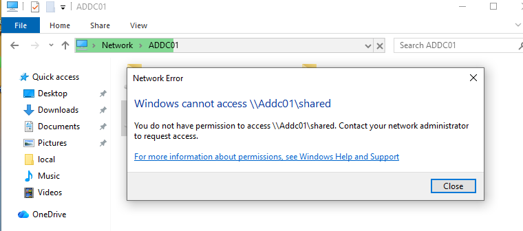

Solution
-	Server Manager > Tools > Users and Computers
-	Right-click on your AD domain > Find > Write down the name
-	Double click on a User >  Member of
The best option is to check the account of another user from the department and add the same groups it belongs to, to this user.
Once everything is set, Bloom can access the files

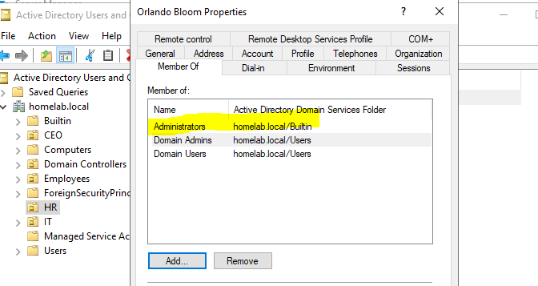

# Skills Gained

By completing this project, we developed practical experience in:

* Installing and configuring Active Directory Domain Services.
* Creating and managing domains and Organizational Units.
* Administering user accounts.
* Applying and managing Group Policy Objects.
* Understanding centralized authentication and authorization.
* Troubleshooting common Active Directory issues.

# Conclusion

This project provided a solid introduction to Active Directory administration and demonstrated how organizations use AD to efficiently manage users, computers, and security policies from a centralized location. Through hands-on configuration and troubleshooting, we gained practical skills that are essential for Windows Server administration and enterprise IT environments.

Overall, this project established a strong foundation for more advanced topics such as group management, DNS integration, roaming profiles, delegation of administrative tasks, PowerShell automation, and Active Directory security best practices.

